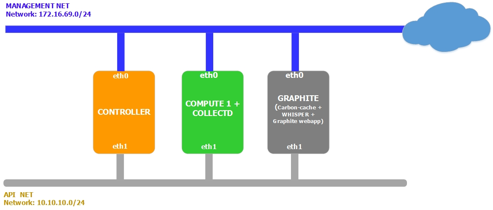

# Giải pháp giám sát Ceph Cluster sử dụng CheckMK.
 - Hướng dẫn sau thực hiện trên phiên bản Check Mk 1.5 và Ceph Luminous 12.2.5

## 1. Mục tiêu tài liệu
Dịch vụ Public cloud cần có khả năng giám sát tập trung hiện trạng các VM, nhằm phục vụ công tác quản trị của quản trị hệ thống. Các thông số cần thiết để giám sát là:
 - Thông số CPU
 - Thông số RAM
 - Thông số network
 - Thông sô Disk

 Để giải quyết vấn đề giám sát VM, có 2 giải pháp:
  - Giải pháp 1: sử dụng gói công cụ collectd + Graphite, đang sử dụng để cung cấp thông tin tài nguyên máy ảo trên Portal.
  - Giải pháp 2: sử dụng Project Ceilometer.


## 2. Giải pháp sử dụng Collectd
### 2.1. Mô hình




 - Collectd hoạt động như 1 daemon cài đặt trên node Compute, thu thập các thông tin về hiệu năng của máy ảo(thông qua 1 plugin làm việc với libvirt), và cung cấp cơ chế để lưu trữ các thông tin thu thập được. Các metric từ collectd được gửi tới carbon/graphite thông qua collectd write_graphite plugin.
 - Graphite là hệ thống hiển thị, đưa các số liệu từ collectd lên dạng biểu đồ, host Graphite có 3 thành phần:
  - carbon-cache: network service lắng nghe các metric được gửi tới, lưu trữ các metric tạm thời ở bộ nhớ buffer-cache trước khi đẩy vào ổ đĩa theo định dạng của Whisper Database.
  - Whisper: database lưu trữ các dữ liệu dạng time-series.
  - Graphite webapp: webapp viết bằng Django, có chức năng render ra đồ thị (sử dụng Cairo)

### 2.2. Hướng dẫn
#### 2.2.1. Trên CheckMK host
- chuyển vào site cần cài đặt, ở đây tên site là *long*
```
su - long
```

- Tải plugin Ceph
```
OMD[long]:~$ wget https://github.com/HeinleinSupport/check_mk/blob/master/ceph/ceph-5.9.4.mkp?raw=true -O ceph-5.9.4.mk
```

- Tiến hành cài đặt plguin Ceph
```
OMD[long]:~$ mkp install ceph-5.9.4.mkp
```

- Tải plugin json
```
OMD[long]:~$ wget https://github.com/HeinleinSupport/check_mk/blob/master/json/json-1.0.mkp?raw=true -O json-1.0.mkp
```

- Chuyển vào thư mục *checks*
```
OMD[long]:~$ cd /local/share/check_mk/checks
```

- Sửa các file *cephdf*, *cephosd*, *cephpools*, *cephstatus*, bổ sung *size_trend.include* trong mục *check_info*
```
    'includes'               : [ 'df.include', 'json.include', "size_trend.include" ],

```

- Chuyển file *ceph* qua host Ceph1 (đã cài CheckMK Agent)
```
OMD[long]:~ scp /local/share/check_mk/agents/plugins/ceph root@172.16.68.86:/usr/lib/check_mk_agent/plugins
```

Tham khảo:

[1] - https://community.rackspace.com/products/f/25/t/6800

[2] - https://collectd.org/wiki/index.php/Plugin:virt

[3] - https://graphite-api.readthedocs.io/en/latest/
