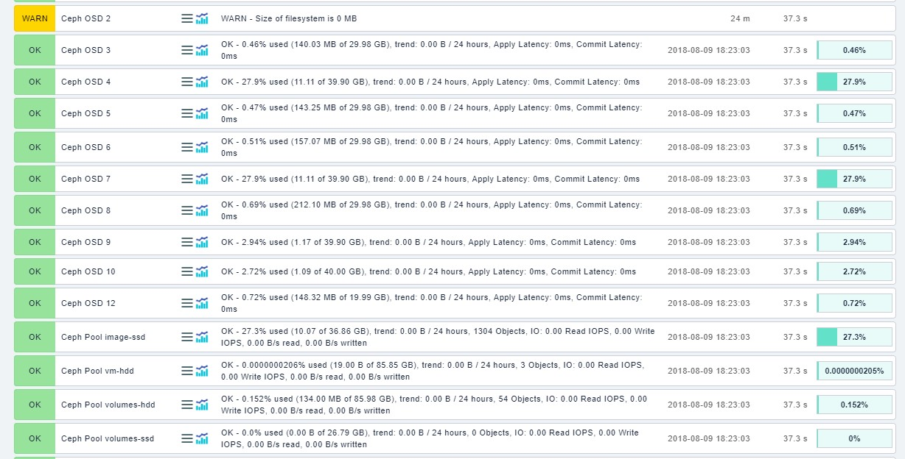

# Giải pháp giám sát Ceph Cluster sử dụng CheckMK.
 - Hướng dẫn sau thực hiện trên phiên bản Check Mk 1.5 và Ceph Luminous 12.2.5


## 1. Hướng dẫn
- Trên host CheckMK, chuyển vào site cần cài đặt, ở đây tên site là *long*
```
su - long
```

- Tải plugin Ceph
```
OMD[long]:~$ wget https://github.com/HeinleinSupport/check_mk/blob/master/ceph/ceph-5.9.4.mkp?raw=true -O ceph-5.9.4.mk
```

- Tiến hành cài đặt plguin Ceph
```
OMD[long]:~$ mkp install ceph-5.9.4.mkp
```

- Tải plugin json
```
OMD[long]:~$ wget https://github.com/HeinleinSupport/check_mk/blob/master/json/json-1.0.mkp?raw=true -O json-1.0.mkp
```

- Chuyển vào thư mục *checks*
```
OMD[long]:~$ cd /local/share/check_mk/checks
```

- Sửa các file *cephdf*, *cephosd*, *cephpools*, *cephstatus*, bổ sung *size_trend.include* trong mục *check_info*
```
    'includes'               : [ 'df.include', 'json.include', "size_trend.include" ],

```

- Chuyển file *ceph* qua host Ceph1 (đã cài CheckMK Agent), có ip 172.16.68.86
```
OMD[long]:~ scp /local/share/check_mk/agents/plugins/ceph root@172.16.68.86:/usr/lib/check_mk_agent/plugins
```

- Trên giao diện CheckMK, add các host Ceph cần giám sát, sẽ có các metric của Ceph xuất hiện
