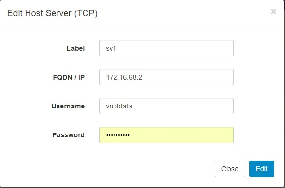

# Hướng dẫn cấu hình Host KVM để kết nối vào Webvirt

## Update package
```sh
apt-get update && apt-get -y upgrade && apt-get -y dist-upgrade
```

## Cài đặt các gói phần mề cho ảo hóa và linux bridge
```sh
apt-get -y install qemu-kvm libvirt-bin
```

## Enable vhost-net
```sh
modprobe vhost_net
echo vhost_net >> /etc/modules
```

Kết quả:
```sh 
lsmod | grep vhost 
vhost_net              20480  0
vhost                  32768  1 vhost_net
macvtap                20480  1 vhost_net
```

## Cấu hình file /etc/libvirt/libvirtd.conf
```sh
listen_tls = 0
listen_tcp = 1
#listen_addr = "0.0.0.0"
unix_sock_group = "libvirtd"
unix_sock_ro_perms = "0777"
unix_sock_rw_perms = "0770"
auth_unix_ro = "none"
auth_unix_rw = "none"
auth_tcp = "none"
```

## Cấu hình file /etc/default/libvirt-bin
```sh
start_libvirtd="yes"
libvirtd_opts="-l -d"
```

## Mở port 16509 cho livirtd
```sh
iptables -I INPUT -m state --state NEW -m tcp -p tcp --dport 16509 -j ACCEPT
```
Nếu sử dụng CentOS 7:
```sh
firewall-cmd --zone=public --add-port 16509/tcp --permanent
```
Nếu sử dụng Ubuntu (các phiên bản)
```sh
ufw allow 16509
```

## Khởi động lại libvirt
```sh
service libvirt-bin restart
```

## Trên Webvirt, connect tới KVM Host
webvirt_1.jpg



Tham khảo:

[1] - https://www.server-world.info/en/note?os=Ubuntu_16.04&p=kvm&f=1
[2] - https://github.com/retspen/webvirtmgr/wiki/Setup-Host-Server