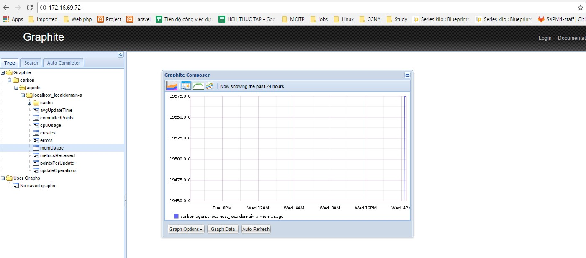

# Giải pháp giám sát máy ảo sử dụng collectd
*Chú ý:*
 - Hướng dẫn sau thực hiện trên phiên bản OpenStack Mitaka

## 1. Mục tiêu tài liệu
Dịch vụ Public cloud cần có khả năng giám sát tập trung hiện trạng các VM, nhằm phục vụ công tác quản trị của quản trị hệ thống. Các thông số cần thiết để giám sát là:
 - Thông số CPU
 - Thông số RAM
 - Thông số network
 - Thông sô Disk

 Để giải quyết vấn đề giám sát VM, có 2 giải pháp:
  - Giải pháp 1: sử dụng gói công cụ collectd + Graphite, đang sử dụng để cung cấp thông tin tài nguyên máy ảo trên Portal.
  - Giải pháp 2: sử dụng Project Ceilometer.


## 2. Giải pháp sử dụng Collectd
### 2.1. Mô hình


 - Collectd hoạt động như 1 daemon cài đặt trên node Compute, thu thập các thông tin về hiệu năng của máy ảo(thông qua 1 plugin làm việc với libvirt), và cung cấp cơ chế để lưu trữ các thông tin thu thập được. Các metric từ collectd được gửi tới carbon/graphite thông qua collectd write_graphite plugin.
 - Graphite là hệ thống hiển thị, đưa các số liệu từ collectd lên dạng biểu đồ, host Graphite có 3 thành phần:
  - carbon-cache: network service lắng nghe các metric được gửi tới, lưu trữ các metric tạm thời ở bộ nhớ buffer-cache trước khi đẩy vào ổ đĩa theo định dạng của Whisper Database.
  - Whisper: database lưu trữ các dữ liệu dạng time-series.
  - Graphite webapp: webapp viết bằng Django, có chức năng render ra đồ thị (sử dụng Cairo)

### 2.2. Hướng dẫn
#### 2.2.1. Trên Graphite Server
- Cài đặt các package của graphite
```
apt-get update
apt-get install graphite-web graphite-carbon -y
```

- Cài và cấu hình PostGre SQL
```
apt-get install postgresql libpq-dev python-psycopg2 -y
```

- Chuyển sang postgres user và tạo DB user graphite_user
```
su - postgres
createuser graphite_user --pwprompt
```
Nhập password:
```
Enter password for new role: 
Enter it again: 
```


- Sử dụng graphite_user, tạo graphite_db và grafana_db 
```
createdb -O graphite_user graphite_db
createdb -O graphite_user grafana_db
```

- Sau khi thực hiện xong, chuyển về user root
```
logout
```

- Sửa file
```
vim /etc/graphite/local_settings.py
```
Cấu hình các thông số để kết nối tới PostGre SQL
```
DATABASES = {
'default': {
   'NAME': 'graphite_db',
   'ENGINE': 'django.db.backends.postgresql_psycopg2',
   'USER': 'graphite_user',
   'PASSWORD': 'graphite_user_password',
   'HOST': '127.0.0.1',
   'PORT': ''
   }
}

# Tạo 1 sceret key để hash
SECRET_KEY = 'secret_key_for_salting_hashes'

# Cấu hình time zone
TIME_ZONE = 'Europe/London'

# Enable việc xác thực
USE_REMOTE_USER_AUTHENTICATION = True
```

- Sync database
```
graphite-manage syncdb
```

Quá trình này sẽ yêu cầu tạo user để login vào giao diện của Graphite
```
You just installed Django's auth system, which means you don't have any superusers defined.
Would you like to create one now? (yes/no): yes
Username (leave blank to use 'root'):
Email address:
Password: 
Password (again): 
Superuser created successfully.
Installing custom SQL ...
Installing indexes ...
Installed 0 object(s) from 0 fixture(s)
```


### 2.2.2.Cấu hình Carbon
- Sửa file /etc/carbon/carbon.conf
```
sed -i.bak s/0.0.0.0/10.10.10.72/g /etc/carbon/carbon.conf

- Copy file cấu hình mẫu
```
cp /usr/share/doc/graphite-carbon/examples/storage-aggregation.conf.example /etc/carbon/storage-aggregation.conf
```
- Cấu hình để carbon tự động khởi động khi boot server
```
vim /etc/default/graphite-carbon
```

Nội dung:
```
CARBON_CACHE_ENABLED=true
```
- Khởi động carbon
```
service carbon-cache start
```
### 2.2.3. Cài đặt và cấu hình Apache + wsgi
- Cài đặt apache
```
apt-get install apache2 libapache2-mod-wsgi -y
```
- disable apache site mặc định
```
a2dissite 000-default
```

- Copy cấu hình host mẫu của Graphite
```
cp /usr/share/graphite-web/apache2-graphite.conf /etc/apache2/sites-available
```

- Enable Graphite virtual host và reload lại apache
```
a2ensite apache2-graphite
service apache2 reload
```

- Truy cập thông qua web


### 2.2.4. Cài đặt và cấu hình CollectD trên node Compute
- Cài đặt collectd
```
apt-get install collectd collectd-utils -y
```
- Cấu hình collect config để enable các plugin thu thập thông số hệ thống và đẩy về graphite
```
vim  /etc/collectd/collectd.conf
```
Nội dung:
```
LoadPlugin cpu
LoadPlugin df
LoadPlugin interface
LoadPlugin load
LoadPlugin memory
LoadPlugin ping
LoadPlugin write_graphite
LoadPlugin libvirt
LoadPlugin network
```
- Một số plugin cần cấu hình các thông số bổ sung
```
<Plugin ping>
       Host "10.10.10.160"
       Interval 1.0
       Timeout 0.9
       TTL 255
       MaxMissed -1
</Plugin>

<Plugin write_graphite>
    <Node "graphite">
            Host "172.16.69.72"
            Port "2003"
            Protocol "tcp"
            LogSendErrors true
            Prefix "collectd."
            StoreRates true
            AlwaysAppendDS false
            EscapeCharacter "_"
    </Node>
</Plugin>

<Plugin libvirt>
    RefreshInterval 120
    Connection "qemu:///system"
    HostnameFormat "uuid"
    InterfaceFormat "address"
</Plugin>

<Plugin network>
    Server "10.193.0.106" "2003"
</Plugin>

```

- Trên Graphite node, sửa file 
```
vim /etc/carbon/storage-schemas.conf
```

```
[collectd]
pattern = ^collectd.*
retentions = 10s:1h,1m:1d,10m:1y
```

- Khởi động lại carbon-cache service
service carbon-cache stop
service carbon-cache start
service collectd restart

Tham khảo:

[1] - https://community.rackspace.com/products/f/25/t/6800

[2] - https://collectd.org/wiki/index.php/Plugin:virt

[3] - https://graphite-api.readthedocs.io/en/latest/
