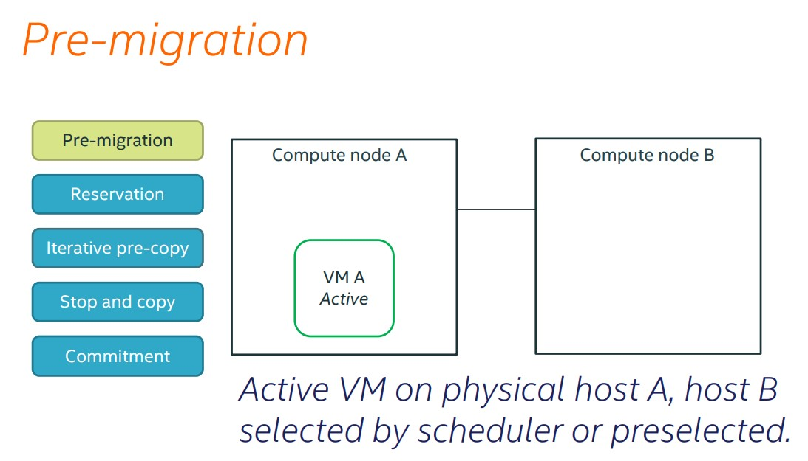
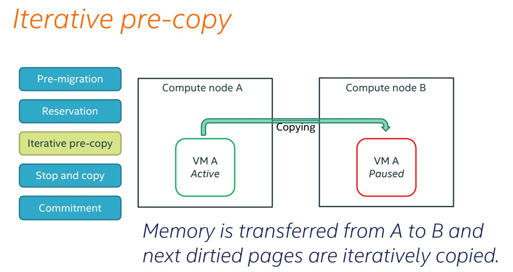
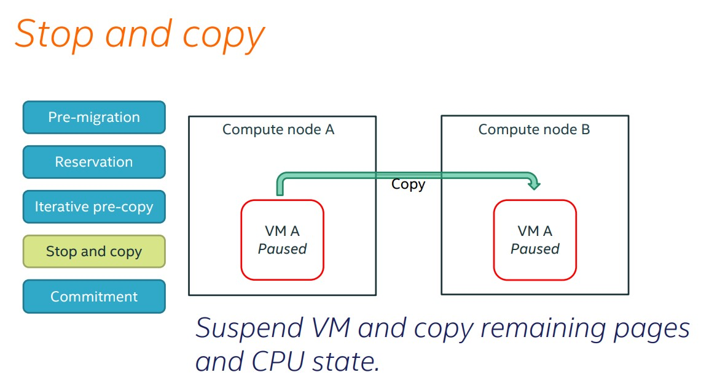
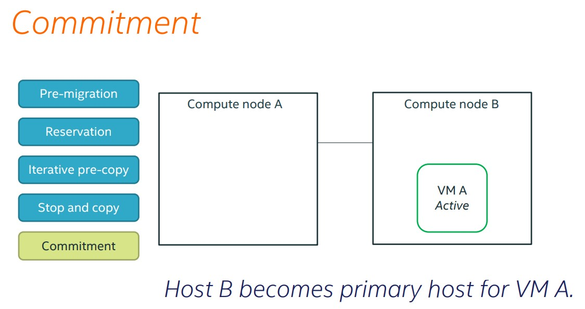

# Hướng dẫn sau giúp xử lý một số lỗi phát sinh khi Live Migration giữa các host Compute trong OpenStack
*Chú ý:*
 - Hướng dẫn sau thực hiện trên phiên bản OpenStack Mitaka

## 1. Tiến trình Live Migration
Tính năng Live Migrate được thực hiện qua các bước sau:
 - Pre-Migration
 - Reservation
 - Iterative pre-copy
 - Stop and copy
 - Commitment

### 1.1. Tiến trình Pre-migration
Nova schedule sẽ tự động lựa chọn host phù hợp để live migrate VM, hoặc user tự chỉ định host.


### 1.2. Tiến trình Reservation
Host Compute đích sẽ xác nhận lại về tài nguyên khả dụng để chứa máy ảo được live-migrate, đặt trước tài nguyên cho máy ảo.


### 1.3. Iterative pre-copy
Dữ liệu từ bộ nhớ (Ram) máy ảo được di chuyển từ host A sang host B (kể cả các dirty pages)


### 1.4. Stop and copy
VM được suspend và copy nốt các pages còn lại và trạng thái CPU sang host đích.


### 1.5. Commitment
Ở bước cuối cùng, trạng thái của VM được cập nhật đã chuyển từ host A sang host B.



## 2. Cải thiện tốc độ live-migration
Quá trình live-migrate có thể kéo dài khi có quá nhiều dirty-pages trên VM, dẫn tới việc live-migrate bị tắc ở tiến trình Iterative pre-copy. Tiến trình này di chuyển lần lượt các dirty page của VM từ host nguồn tới host đích cho tới một ngưỡng dirty pages nhất định hệ thống sẽ suspend VM và chuyển trạng thái VM sang host đích (thời gian downtime mặc định cho phép của KVM/QEMU/Libvirt là 20ms)

Do đó, để tăng tốc độ live-migration, thêm cấu hình sau vào file nova.conf tại các host Compute (nguồn và đích):
```
[libvirt]
live_migration_flag += VIR_MIGRATE_AUTO_CONVERGE
```

Cấu hình trên sẽ tăng thời gian cho phép downtime mặc định của KVM, giúp hoàn thành việc di chuyển các dirty pages giữa 2 host.

## 3. Live-migrate VM giữa các host Compute có CPU khác nhau
Khi live-migrate VM giữa các host Compute có CPU khác nhau, VM sẽ chỉ migrate được từ Compute có CPU đời thấp lên Compute có CPU đời cao mà không thể migrate theo chiều ngược lại. Để khắc phục, thêm cấu hình sau vào file nova.conf trên tất cả các host Compute:

```
cpu_mode=custom
cpu_model=kvm64
```

Lưu ý: cần phải khởi động lại tất cả VM trên các host để VM nhận cấu hình trên.

Tham khảo:

[1] - https://www.server24.eu/private-cloud/complete-live-migration-vms-high-load/

[2] - https://01.org/sites/default/files/dive_into_vm_live_migration_2.pdf
