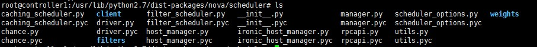
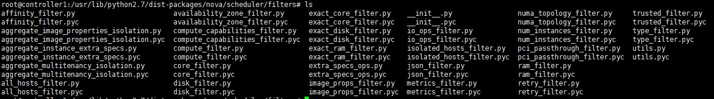

# Hướng dẫn sử dụng Nova Scheduler
*Chú ý:*
 - Hướng dẫn sau thực hiện trên phiên bản OpenStack Mitaka

## 1. Giới thiệu về Nova Scheduler
Nova sử dụng `nova-scheduler` để thực hiện việc điều phối các yêu cầu tạo máy ảo. `nova-scheduler` xác định VM sẽ được tạo trên host vật lý nào (Host là các vật lý mà trên đó chạy service `nova-compute`).
Nova scheduler được cấu hình với một số thông số mặc định sau (nằm trong file `/etc/nova/nova.conf`):

```
[DEFAULT]
...
# scheduler cache danh sách các host khả dụng trong 60 giây
scheduler_driver_task_period = 60
scheduler_driver = nova.scheduler.filter_scheduler.FilterScheduler
scheduler_available_filters = nova.scheduler.filters.all_filters
scheduler_default_filters = RetryFilter, AvailabilityZoneFilter, RamFilter, DiskFilter, ComputeFilter, ComputeCapabilitiesFilter, ImagePropertiesFilter, ServerGroupAntiAffinityFilter, ServerGroupAffinityFilter
...
```

## 1. Filter Driver
Nova scheduler cấu hình mặc định sử dụng `FilterScheduler` driver. Driver này sử dụng cơ chế filter và weight để lựa chọn máy ảo sẽ được tạo ở đâu.
Thư mục chứa filter driver được đặt ở `/usr/lib/python2.7/dist-packages/nova/scheduler`


Có thể lựa chọn các driver sau:
 - CachingScheduler: 
 - ChanceScheduler: lựa chọn ngẫu nhiên các host
 - FilterScheduler: lựa chọn host bằng cơ chế filter và weight

## 2. Filters
Khi filter driver nhận được yêu cầu tạo máy ảo, nó sẽ áp vào các bộ lọc(filter) để xác định các host nào thích hợp. Các host sau khi được lọc bởi filter sẽ thông qua weight để xác định chính xác host sẽ tạo máy ảo.
Thư mục chứa các filter được đặt ở `/usr/lib/python2.7/dist-packages/nova/scheduler/filters`


## 3. Weight
Sau khi lọc ra các host thích hợp cho việc tạo máy ảo, Nova scheduler sử dụng cơ chế weight để xác định host nào phù hợp nhất. Weight được tính toán trên mỗi host khi có 1 yêu cầu điều độ máy ảo. Scheduler tính toán weight của host dựa trên việc sử dụng tài nguyên trên host đó. 

Các chỉ số được sử dụng để tính toán weight trên từng host:
 - RAM: Phần trăm RAM còn trống
 - IO: Số lượng request đang được tải (build, resize, snapshot, migrate, rescue)
 - CPU: Phần trăm vCPU còn trống
 - Affinity: Số lượng máy ảo đang nằm trên các host
 - Các metric phụ gồm: (các metric này không phải mặc định, người dùng cần khai báo thêm trong trường 'metrics')
 		CPU_FREQUENCY,
        CPU_USER_TIME,
        CPU_KERNEL_TIME,
        CPU_IDLE_TIME,
        CPU_IOWAIT_TIME,
        CPU_USER_PERCENT,
        CPU_KERNEL_PERCENT,
        CPU_IDLE_PERCENT,
        CPU_IOWAIT_PERCENT,
        CPU_PERCENT,

Nova scheduler tính toán weight bằng cách nhân các tài nguyên trên với 1 hệ số  "multiplier".

Hệ số multiplier được định nghĩa trong file `/etc/nova/nova.conf` như sau:

```
[DEFAULT]
...
scheduler_host_subset_size = 1
scheduler_weight_classes = nova.scheduler.weights.all_weighers
# Hệ số cho RAM
ram_weight_multiplier = 1.0
# Hệ số cho IO
io_ops_weight_multiplier = 2.0
# Hệ số cho affinity
soft_affinity_weight_multiplier = 1.0
# Hệ số cho anti-affinity
soft_anti_affinity_weight_multiplier = 1.0
# CPU mặc định là 1.0
...
```

Để khai báo các metric phụ (ở đây ta monitor các thông số của CPU, do đó phải enable việc monitor các thông số CPU của host)

```
[DEFAULT]
...
# enable monitor các metric của CPU
compute_avaiable_monitors = nova.compute.monitors.all_monitors
compute_monitors = ComputeDriverCPUMonitor
...
[metrics]
# Hệ số cho tổng các metric
weight_multiplier = 1.0
# Khai báo các emtric sẽ được đánh weight
weight_setting = cpu.user.percent=1.0, cpu.idle.time=-1.0
# Khai báo giá trị trả về nếu như host không chứa metric được đánh weight.
required = false
weight_of_unavailable = -10000.0
```

Như vậy tổng weight trên 1 host như sau:
```
%RAM trống * 1.0 + %CPU trống * 1.0 + số lượng máy ảo * 1.0 + số lượng IO * 2.0 + số lượng máy ảo soft-affinity * 1.0 + số lượng máy ảo soft-anti-affinity * 1.0 + (cpu.user.percent * 1.0 + cpu.idle.time * -1.0) * 1.0
```

Host nào có weight lớn nhất sẽ dược đặt độ ưu tiên cao nhất. Mặc định, scheduler lựa chọn host có weight lớn nhất. Nova cung cấp thêm lựa chọn là 'scheduler_host_subset_size' (giá trị là string), cho phép định nghĩa một nhóm số lượng các host có weight lớn nhất, sau đó scheduler lựa chọn ngẫu nhiên 1 host trong nhóm đó để tạo máy ảo. Default `scheduler_host_subset_size=1`.


Tham khảo:

[1] - https://docs.openstack.org/mitaka/config-reference/compute/scheduler.html

[2] - http://egonzalez.org/openstack-segregation-with-availability-zones-and-host-aggregates/

[3] - https://access.redhat.com/documentation/en-US/Red_Hat_Enterprise_Linux_OpenStack_Platform/4/html/Configuration_Reference_Guide/host-aggregates.html

[4] - https://www.amazon.com/Production-Ready-OpenStack-Successful-Environments-ebook/dp/B013QA82WI

[5] - http://williamherry.blogspot.com/2012/05/openstack-nova-scheduler-and-its.html